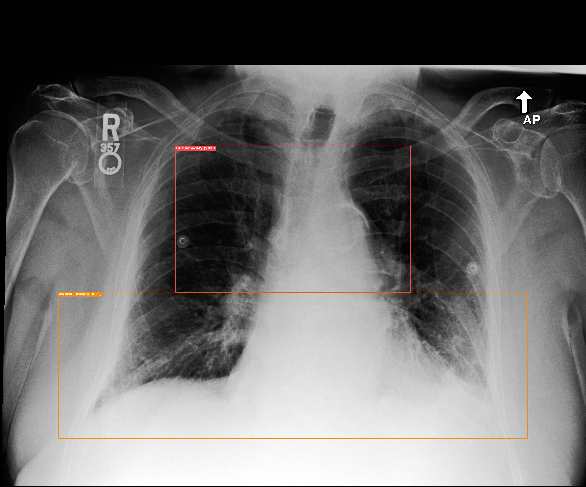
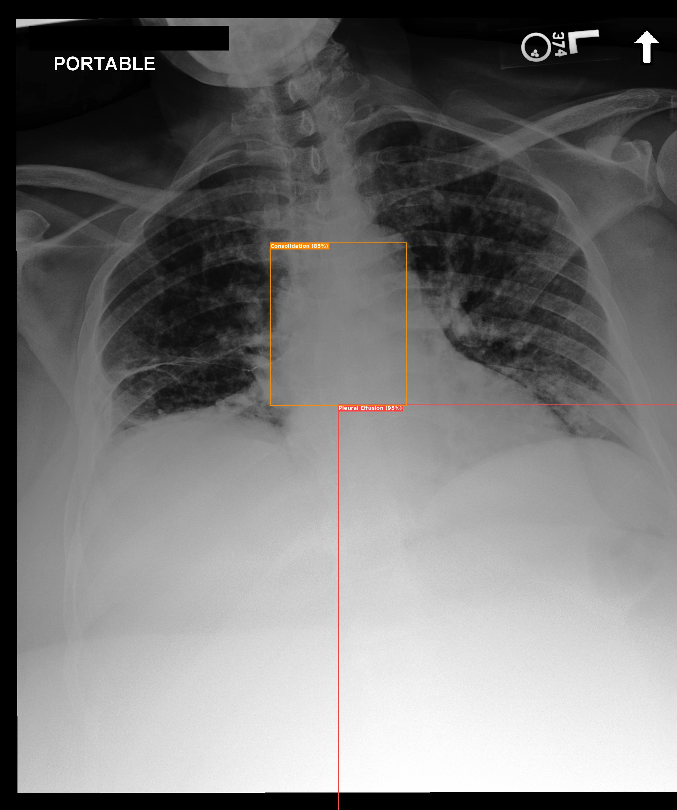
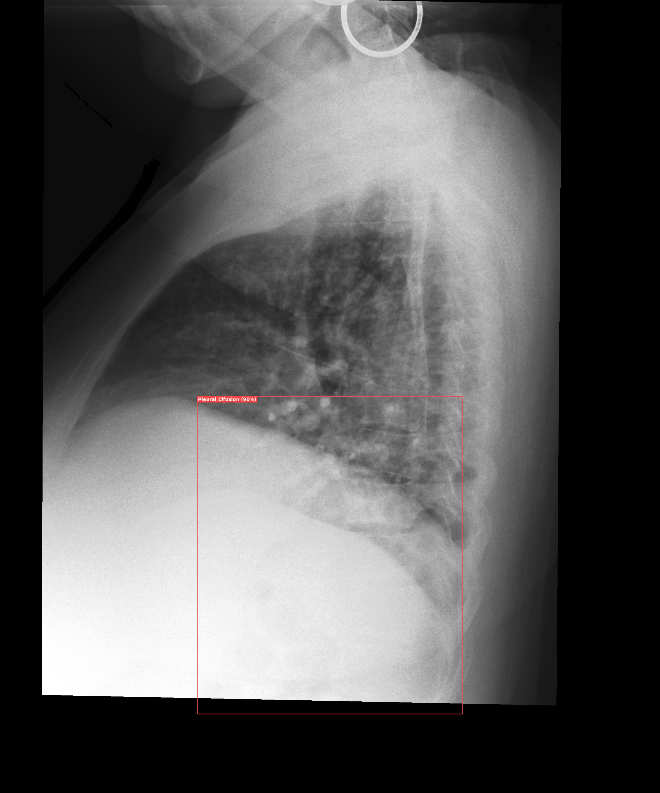

---

## Overview

| | |
|---|---|
| **모델** | GPT-4o (Vision) |
| **입력** | 흉부 X-ray 이미지 (JPG / PNG) |
| **출력** | 이상 소견 텍스트 + 바운딩 박스가 그려진 annotated 이미지 |
| **데이터** | MIMIC-CXR-JPG v2.1.0 (5 samples) |
| **플러그인 포맷** | ChatClinic plugin (`tool.json` + `logic.py`) |

---

## How It Works

```
X-ray Image
    │
    ▼
[GPT-4o Vision API]
    │  ┌─────────────────────────────────┐
    │  │ System Prompt (Radiologist)      │
    │  │  → Detect abnormal findings      │
    │  │  → Return bounding boxes (0~1)   │
    │  └─────────────────────────────────┘
    │
    ▼
Structured JSON Output
{
  "abnormal": true,
  "impression": "...",
  "findings": [...],
  "bounding_boxes": [
    {"label": "Consolidation", "x1": 0.3, "y1": 0.4, "x2": 0.7, "y2": 0.8}
  ]
}
    │
    ▼ (abnormal == true)
[PIL Drawing]
    │  → Color-coded bounding boxes
    │  → Label + confidence score
    ▼
Annotated Image saved to outputs/
```

1. X-ray 이미지를 base64 인코딩 후 GPT-4o vision API에 전송
2. 방사선과 전문의 역할의 system prompt로 CheXpert 14개 카테고리 기준 이상 소견 탐지
3. 각 소견의 위치를 정규화 좌표 (0~1) bounding box로 반환
4. PIL로 컬러 박스 + 레이블 + confidence를 이미지에 렌더링

---

## Output Examples

> MIMIC-CXR 데이터 5개 샘플에 대한 실행 결과입니다.

### Sample 1 — Cardiomegaly + Pleural Effusion

| | |
|---|---|
| **Ground Truth** | Consolidation |
| **GPT Impression** | Cardiomegaly with bilateral pleural effusion. |
| **Detected** | Cardiomegaly (90%), Pleural Effusion (85%) |



---

### Sample 2 — Pleural Effusion + Consolidation

| | |
|---|---|
| **Ground Truth** | Pleural Effusion, Pneumonia |
| **GPT Impression** | Large right pleural effusion with possible underlying consolidation. |
| **Detected** | Pleural Effusion (95%), Consolidation (85%) |



---

### Sample 3 — Pleural Effusion

| | |
|---|---|
| **Ground Truth** | Lung Opacity |
| **GPT Impression** | Presence of a pleural effusion on the right side. |
| **Detected** | Pleural Effusion (90%) |



---

### Sample 4 — Normal (No Finding)

| | |
|---|---|
| **Ground Truth** | Fracture |
| **GPT Impression** | Normal chest X-ray with no abnormal findings. |
| **Detected** | — (Normal) |

> abnormal=false 판정 시 바운딩 박스를 그리지 않습니다.

---

## Project Structure

```
chatclinic-xray-grounding/
├── demo.py                        # 5개 MIMIC 샘플 데모 실행 스크립트
├── environment.yml                # conda 환경 설정 (chatclinic-multimodal 기반)
├── plugin/
│   ├── tool.json                  # ChatClinic 플러그인 디스크립터
│   ├── logic.py                   # 핵심 로직: execute(payload) → dict
│   ├── run.py                     # CLI 래퍼
│   ├── requirements.txt           # pip 의존성
│   └── README.md                  # 플러그인 상세 문서
├── skill_update/
│   ├── skill_patch.md             # ChatClinic Skill 패치 제안
│   └── skill_rationale.md        # 도구 선택 근거
├── references/
│   └── background_papers.md      # 참고 논문 목록
└── assets/
    ├── sample1_*.jpg              # 예시 출력 이미지
    ├── sample2_*.jpg
    └── sample3_*.jpg
```

---

## Setup

### 1. 환경 설치

```bash
# conda 환경 생성 (권장)
conda env create -f environment.yml
conda activate chatclinic

# 또는 pip만으로 설치
pip install -r plugin/requirements.txt
```

### 2. API 키 설정

```bash
export OPENAI_API_KEY="sk-..."
```

---

## Usage

### 데모 실행 (MIMIC 5 샘플)

```bash
python demo.py
```

### CLI — 단일 이미지 분석

```bash
python plugin/run.py /path/to/chest_xray.jpg
```

### Python API

```python
from plugin.logic import execute

result = execute({
    "image_path": "/path/to/chest_xray.jpg",
    "save_annotated": True,          # outputs/ 에 annotated 이미지 저장
    "output_dir": "./outputs",
})

print(result["impression"])          # 소견 요약
print(result["findings"])            # 탐지된 이상 소견 리스트
print(result["bounding_boxes"])      # 바운딩 박스 좌표
print(result["annotated_image_path"]) # 저장된 이미지 경로
```

### 출력 형식

```json
{
  "image_path": "/path/to/cxr.jpg",
  "abnormal": true,
  "impression": "Bilateral consolidation consistent with pneumonia.",
  "findings": ["Right lower lobe consolidation", "Left perihilar opacity"],
  "bounding_boxes": [
    {
      "label": "Consolidation",
      "x1": 0.55, "y1": 0.55,
      "x2": 0.85, "y2": 0.90,
      "confidence": 0.92
    }
  ],
  "annotated_image_path": "outputs/image_grounded.jpg",
  "error": null
}
```

---

## Dataset

[MIMIC-CXR-JPG v2.1.0](https://physionet.org/content/mimic-cxr-jpg/2.1.0/) — 흉부 X-ray 공개 데이터셋  
CheXpert 레이블 기준 14개 카테고리: Atelectasis, Cardiomegaly, Consolidation, Edema, Enlarged Cardiomediastinum, Fracture, Lung Lesion, Lung Opacity, No Finding, Pleural Effusion, Pleural Other, Pneumonia, Pneumothorax, Support Devices

---

## ChatClinic Plugin Spec

| 항목 | 값 |
|---|---|
| `name` | `xray_grounding_tool` |
| `modality` | `medical-image` |
| `source_types` | `image` |
| `entrypoint` | `plugins.xray_grounding_tool.logic:execute` |
| `trigger_keywords` | xray, x-ray, chest, cxr, radiology, grounding |
| `result_slot` | `xray_grounding_result` |

---

## Limitations

- GPT-4o 바운딩 박스는 모델 예측값이며 픽셀 단위 segmentation이 아닙니다.
- Lateral(측면) 뷰에서는 성능이 저하될 수 있습니다.
- API 호출 지연: 이미지 1장당 약 10~20초 소요됩니다.

---

## References

- [MIMIC-CXR-JPG Dataset](https://physionet.org/content/mimic-cxr-jpg/2.1.0/)
- [CheXpert Paper (Irvin et al., AAAI 2019)](https://arxiv.org/abs/1901.07031)
- [GPT-4 Technical Report (OpenAI, 2023)](https://arxiv.org/abs/2303.08774)
- [ChatClinic-Multimodal Platform](https://github.com/bispl-create/chatclinic-multimodal)
